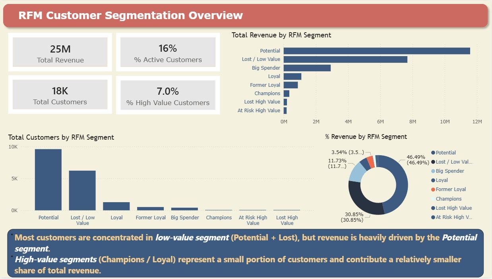

# RFM-Customer-Segmentation-Analysis
RFM analysis combining statistical scoring and business segmentation to generate actionable customer insights.
📌 Project Overview

This project applies RFM (Recency, Frequency, Monetary) analysis to understand customer behavior and identify key segments that drive business performance.

The objective is not only to calculate RFM scores, but to translate data into actionable business insights.

⸻

🧠 Analytical Approach

Two different approaches were used in this project:

1. Statistical Scoring (for analysis)

* Continuous scoring (0–1) was applied to Recency, Frequency, and Monetary values
* This allows better comparison across customers and supports analytical accuracy
* Suitable for modeling and understanding customer behavior patterns

2. Business Segmentation (for decision-making)

* Customers were grouped into segments (e.g., Champions, Loyal, At Risk, Lost)
* This approach simplifies interpretation and supports business actions
* Designed for stakeholder communication and strategy development

👉 Best practice:
Use scoring for analysis, and segmentation for storytelling & decision-making.

⸻

📊 Key Insights

* Revenue is highly concentrated in a small group of customers (Pareto effect)
* A large portion of customers are low-value and under-engaged
* High-value customers represent a small segment but are critical for revenue stability
* There is strong potential to convert mid-tier customers into high-value segments

⸻

💡 Business Recommendations

* Prioritize retention strategies for high-value customers
* Develop targeted campaigns to convert potential customers into loyal customers
* Reduce dependency on a small customer base by expanding mid-value segments
* Improve engagement frequency through loyalty programs and personalized offers

⸻

🛠 Tools & Techniques

* Power BI (Data modeling, DAX, visualization)
* RFM framework
* Data transformation & cleaning (Power Query)

⸻

📌 Key Takeaway

This project demonstrates that data analysis is not only about calculating metrics, but about understanding customer value and turning insights into strategic actions.

## 📊 RFM Customer Segmentation Dashboard

The dashboard visualizes customer distribution and revenue contribution across RFM segments. It highlights key patterns such as revenue concentration, segment imbalance, and opportunities for customer growth and retention.
